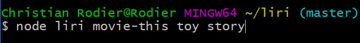

1. In the comand prompt, install the NPM packages require & bandsintown
2. Open in the command Prompt

-Type node spotify-this-song song name to find information on that song in Spotify. 
Example: node liri spotify-this-song Stairway to Heaven

-Type node movie-this movie title to find more information on your favorite flick.
Example: node liri movie-this Toy Story

-Type node concert-this musician name to find more information on your favorite band's upcomming concerts.
Example: node liri concert-this Metallica

